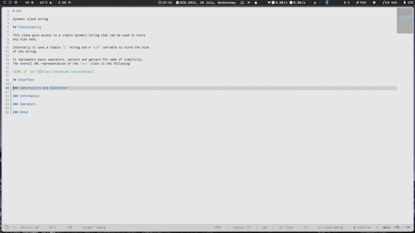

# KeyHUD

Simple key HUD display for lite-xl.



## Configuration

The behaviour can be configured using the following settings:

 - custom key mapping: table `config.plugins.keyhud.stroke_map`
 - time after release: `config.plugins.keyhud.max_time`
 - show only key mapped: `config.plugins.keyhud.only_mapped`
 - stroke filters: `config.plugins.keyhud.filters`
 - HUD position: `config.plugins.keyhud.position` (`left` or `right`, the default)

For the style of the HUD:

 - background color: `style.keyhud.background` (default: `#00000066`)
 - text color: `style.keyhud.text` (default: `#ffffffdd`)
 - font: `style.keyhud.text` (default: `big_font`)

## Example of configuration

```lua
local config = require "core.config"

config.plugins.keyhud.max_time = 0.25
config.plugins.keyhud.stroke_map = {
  ["left shift"] = "<SHFT", -- just for the example
  ["righ shift"] = "SHIFT>",
  ["left ctrl"] = "<CTRL",
  ["right ctrl"] = "CTRL>",
}
```
### My Configuration

```lua
local config = require "core.config"
local style = require "core.style"

config.plugins.keyhud.position = 'left'
config.plugins.keyhud.stroke_map["left gui"] = "⌘"
config.plugins.keyhud.stroke_map["right gui"] = "⌘"
config.plugins.keyhud.stroke_map["space"] = "␣"
config.plugins.keyhud.stroke_map["tab"] = "⇥"
config.plugins.keyhud.stroke_map["return"] = "⏎"
config.plugins.keyhud.stroke_map["pageup"] = "⇞"
config.plugins.keyhud.stroke_map["pagedown"] = "⇟"
config.plugins.keyhud.stroke_map["end"] = "↘"
config.plugins.keyhud.stroke_map["home"] = "↖"

style.keyhud.font = renderer.font.load("FiraCodeNerdFontMono-Regular.ttf", 24 * SCALE)
```

